# ContiNew Admin 中后台管理框架

<a href="https://github.com/Charles7c/continew-admin/blob/dev/LICENSE" target="_blank">

</a>
<a href="https://github.com/Charles7c/continew-admin" target="_blank">

</a>
<a href="https://github.com/Charles7c/continew-admin" target="_blank">

</a>
<a href="https://github.com/Charles7c/continew-admin" target="_blank">

</a>
<a href="https://gitee.com/Charles7c/continew-admin" target="_blank">

</a>
<a href="https://gitee.com/Charles7c/continew-admin" target="_blank">

</a>
<a href="https://github.com/Charles7c/continew-starter" target="_blank">

</a>
<a href="https://github.com/Charles7c/continew-starter" target="_blank">

</a>
<a href="https://github.com/Charles7c/continew-starter" target="_blank">

</a>

📚 [在线文档](https://doc.charles7c.top) | 🚀 [演示地址](https://cnadmin.charles7c.top)（账号/密码：admin/admin123）

## 简介

ContiNew Admin （Continue New Admin）中后台管理框架/脚手架，持续以最新流行技术栈构建，拥抱变化，迭代优化。依托开源协作模式，提升技术透明度、放大集体智慧、共创优秀实践，源源不断地为企业级项目开发提供助力。当前采用的技术栈：Spring Boot3（Java17）、Vue3 & Arco Design、Sa-Token、MyBatis Plus、Redisson、Liquibase、JustAuth、Easy Excel、Hutool、TypeScript、Vite4 等。

## 项目源码

|        | 后端源码                                | 前端源码                                   |
|--------| ----------------------------------------- | -------------------------------------------- |
| GitHub | [github.com/Charles7c/continew-admin](https://github.com/Charles7c/continew-admin) | [github.com/Charles7c/continew-admin-ui](https://github.com/Charles7c/continew-admin-ui) |
| Gitee  | [gitee.com/Charles7c/continew-admin](https://gitee.com/Charles7c/continew-admin) | [gitee.com/Charles7c/continew-admin-ui](https://gitee.com/Charles7c/continew-admin-ui) |

## 主要特性

- :fire: 下方部分通用基础能力及配置，已抽取到 [ContiNew Starter](https://github.com/Charles7c/continew-starter) 项目，现已发布到 Maven 中央仓库，为 Spring Boot Web 项目开发提供更灵活的助力
- 精选技术栈：使用综合考虑成熟度、流行性、发展潜力较佳的技术栈，包括 Spring Boot、MyBatis Plus、Sa-Token、Hutool 等
- 高效率开发：后端提供了 CRUD 组件，在 Controller 中只需添加一个注解，即可自动生成增、删、改、查、分页、列表、树列表等 API
- 提供代码生成功能，根据用户提供的项目信息和配置，自动生成前后端项目结构、代码文件和部分逻辑代码，提高开发效率
- 一个注解解决一个条件查询，基于注解的通用查询方式，降低拼接 MyBatis Plus QueryWrapper 的烦恼
- 提供一套 Base 基类（BaseDO、BaseResp、BaseController、BaseService、扩展版 BaseMapper 等），方便复用和扩展
- 编写或基于 Hutool 扩展部分工具类，提供校验工具和实践，提高开发效率（能 PR 到 Hutool 的已尽量 PR）
- 支持 API 级别的功能权限与数据权限，可自定义操作
- 前后端统一异常拦截处理，统一输出异常信息，避免繁琐的异常判断
- 自动初始化数据：通过 Liquibase 管理数据库脚本版本记录，并在系统第一次启动时自动进行数据初始化，无须额外配置导入
- 提供多项实用基础配置，例如：Jackson 针对日期、通用枚举的序列化、反序列化配置，统一线程池配置等
- 良好的代码、配置文件结构和命名，完善的代码注释甚至包括 Git Commit 信息、接口文档参数示例，遵循阿里巴巴 <a href="https://github.com/Charles7c/continew-admin/blob/dev/code-style/Java%E5%BC%80%E5%8F%91%E6%89%8B%E5%86%8C(%E9%BB%84%E5%B1%B1%E7%89%88).pdf" target="_blank">《Java开发手册(黄山版)》</a> 的代码规范，保证代码质量和可维护性
- 更多细节及实践，敬请探索与关注

##  系统功能

> **Note**
> 更多功能和优化正在赶来💦，最新项目计划、进展请进群或关注 [任务清单](https://doc.charles7c.top/admin/intro/require.html#任务清单) 和 [更新日志](https://doc.charles7c.top/admin/other/changelog.html)。

- 个人中心：支持基础信息修改、安全设置（密码修改、邮箱绑定、手机号绑定、第三方账号绑定/解绑）、头像裁剪上传、个人操作日志查看
- 用户管理：提供用户的相关配置，新增用户后，默认密码为 123456
- 部门管理：可配置系统组织架构，树形表格展示
- 角色管理：对权限与菜单进行分配，可根据部门设置角色的数据权限
- 菜单管理：已实现菜单动态路由，后端可配置化，支持多级菜单
- 公告管理：提供公告的发布、查看和删除等功能。管理员可以在后台发布公告，并可以设置公告的生效时间、终止时间，以 markdown-it 为内核渲染 Markdown 格式内容显示
- 消息管理：提供消息查看、标记已读、全部已读、删除等功能（适配对接导航栏站内信功能）
- 字典管理：提供对系统公用数据字典的维护，例如：公告类型，支持字典标签背景色和排序等配置
- 文件管理：提供文件上传、下载、预览（目前支持图片、音视频）、重命名、切换视图（列表、网格）等功能
- 存储库管理：提供文件存储库新增、编辑、删除、导出等功能
- 系统配置：提供修改系统标题、Logo、favicon 等基础配置功能，以方便用户系统与其自身品牌形象保持一致（暂未开放高级配置）
- 代码生成：提供根据数据库表自动生成相应的前后端 CRUD 代码的功能
- 在线用户：管理当前登录用户，可一键踢下线
- 日志管理：提供在线用户监控、登录日志监控、操作日志监控和系统日志监控等监控功能

## 系统截图

> **Note**
> 受篇幅长度及功能更新频率影响，下方仅为系统 **部分** 功能于 **2023年11月4日** 进行的截图，更多新增功能及细节请登录演示环境或 clone 代码到本地启动查看。

<table border="1" cellpadding="1" cellspacing="1" style="width: 500px">
    <tbody>
        <tr>
            <td></td>
            <td></td>
        </tr>
        <tr>
            <td></td>
            <td>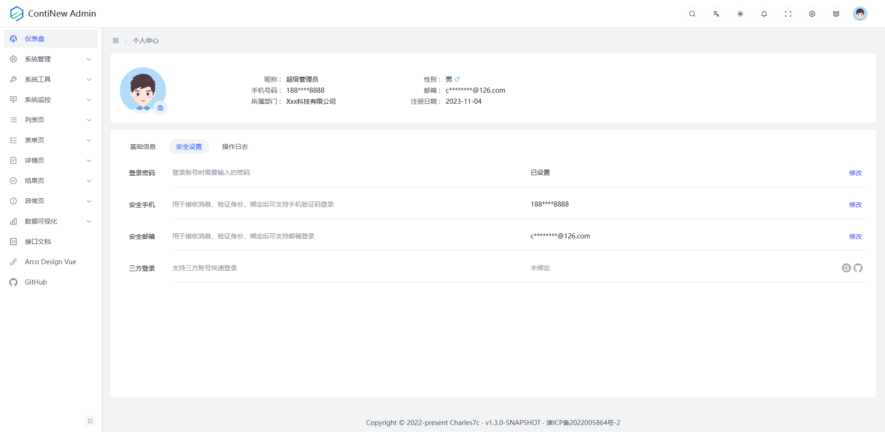</td>
        </tr>
        <tr>
            <td>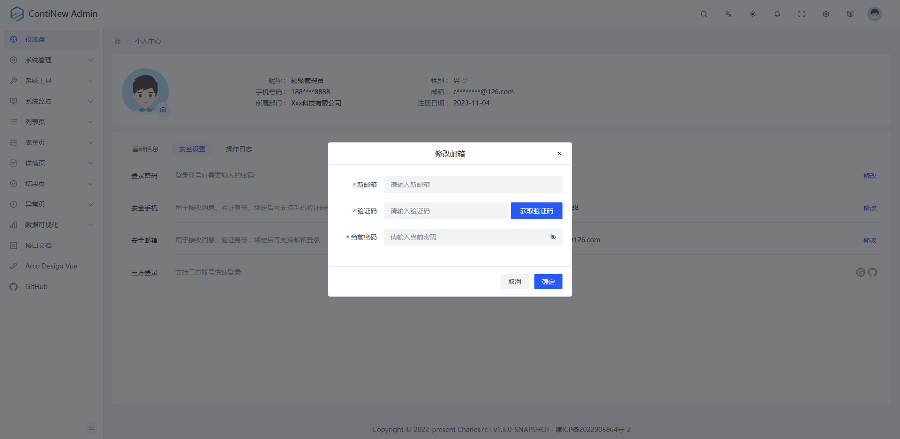</td>
            <td>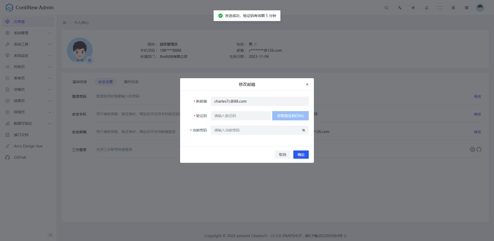</td>
        </tr>
        <tr>
            <td></td>
            <td>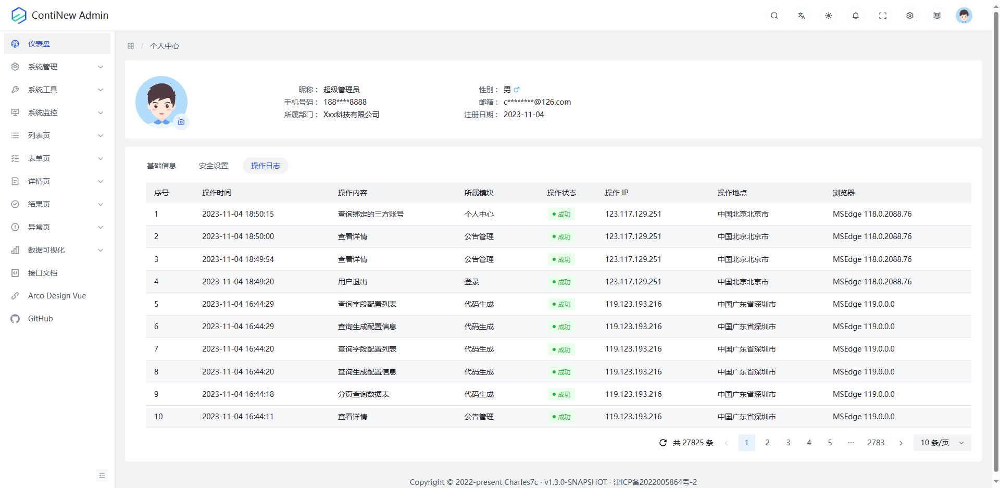</td>
        </tr>
        <tr>
            <td>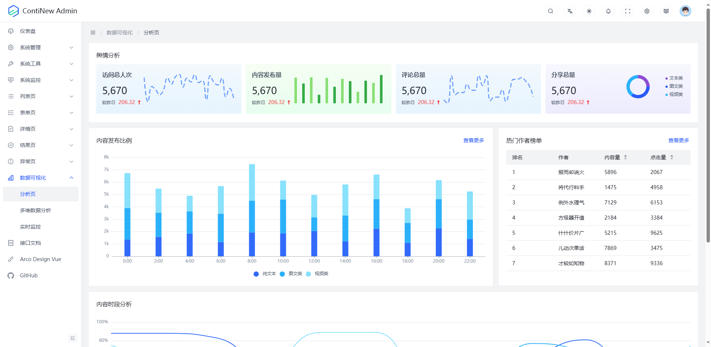</td>
            <td>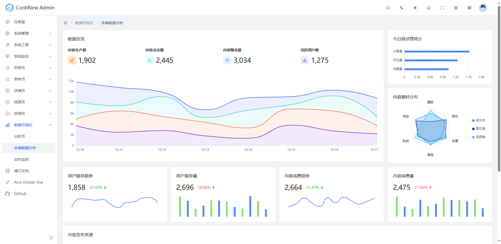</td>
        </tr>
        <tr>
            <td></td>
            <td></td>
        </tr>
        <tr>
            <td></td>
            <td></td>
        </tr>
        <tr>
            <td></td>
            <td></td>
        </tr>
        <tr>
            <td></td>
            <td></td>
        </tr>
        <tr>
            <td></td>
            <td>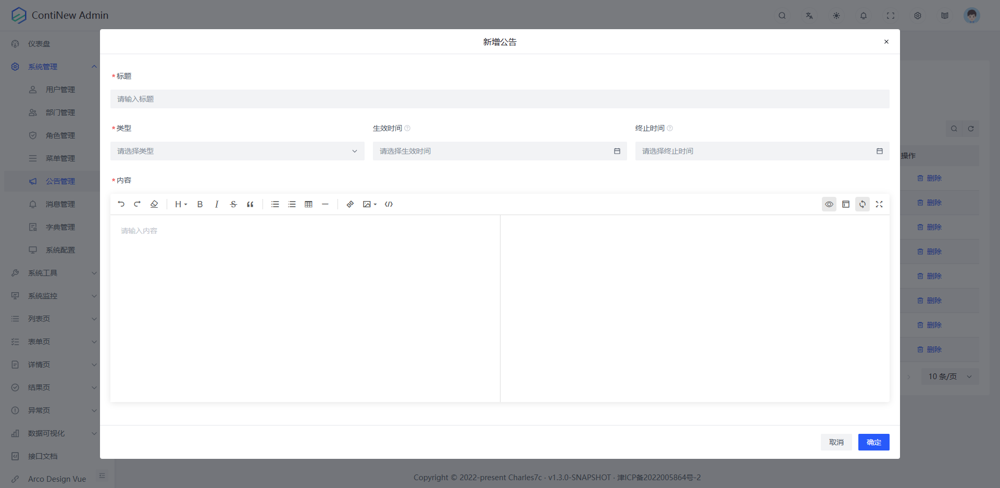</td>
        </tr>
        <tr>
            <td>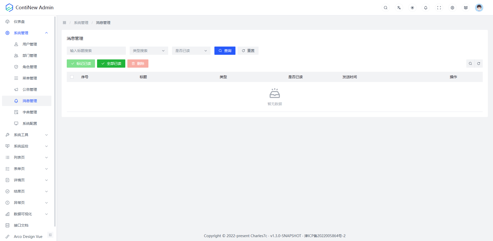</td>
            <td>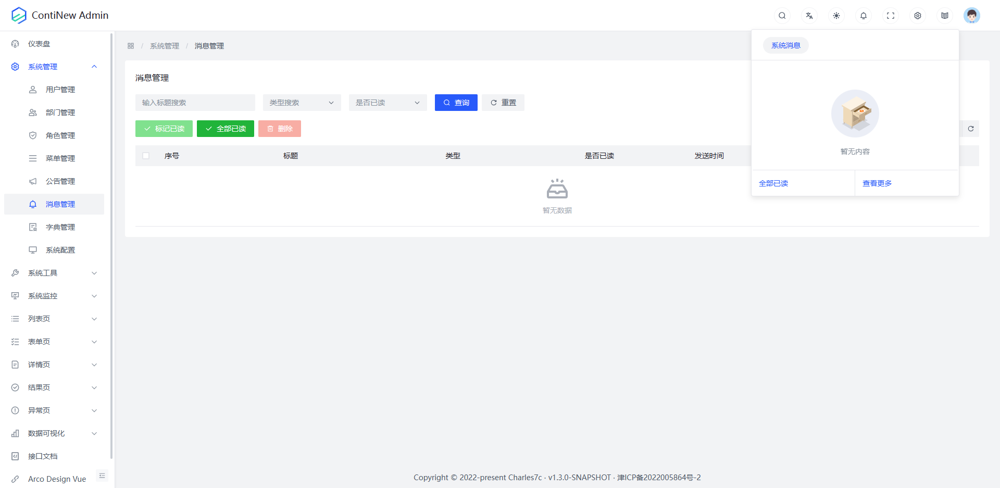</td>
        </tr>
        <tr>
            <td>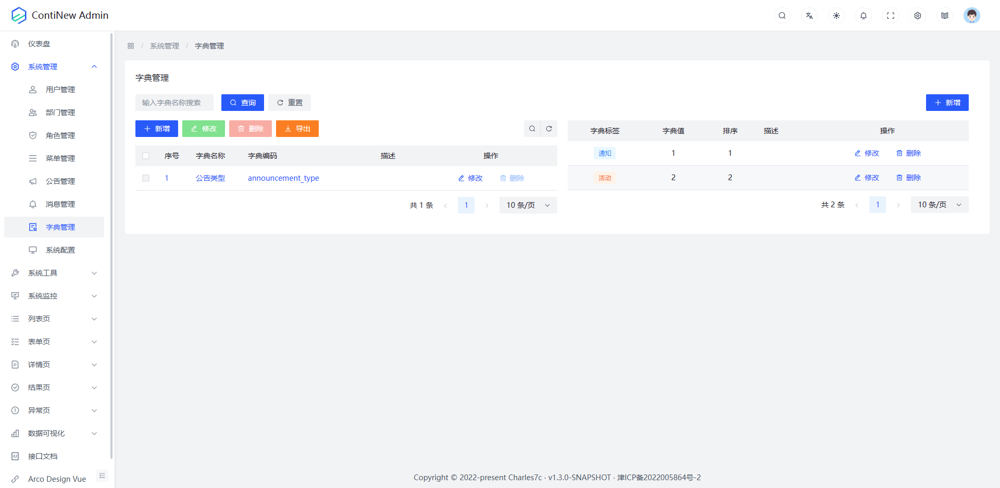</td>
            <td>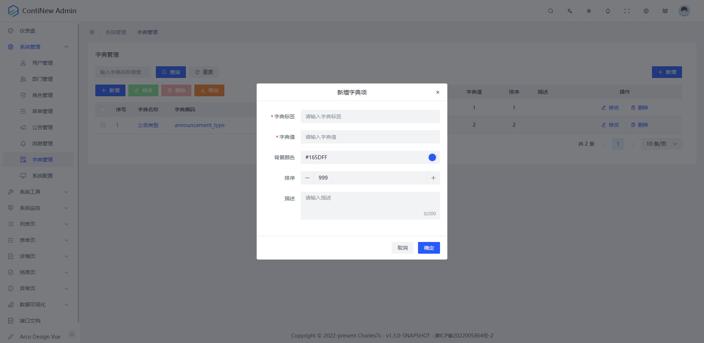</td>
        </tr>
        <tr>
            <td>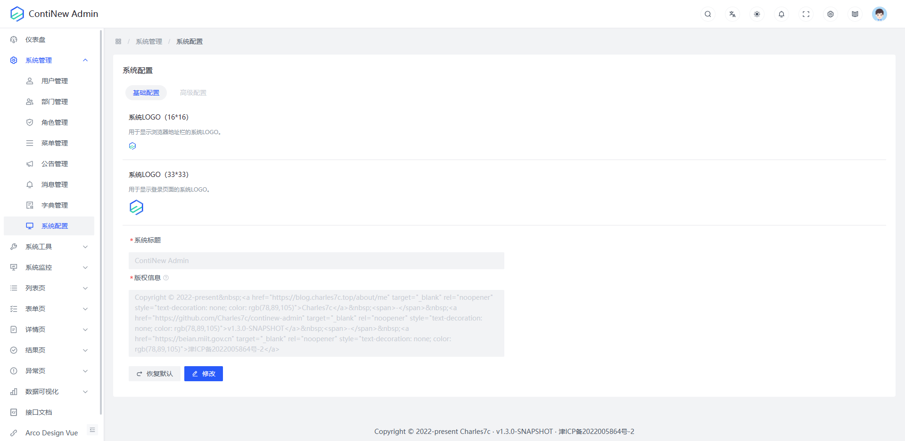</td>
            <td>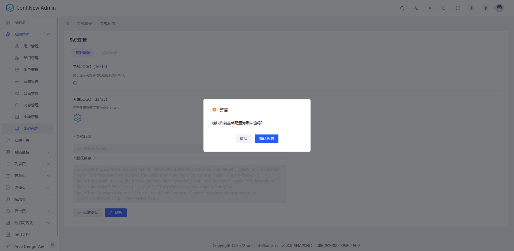</td>
        </tr>
        <tr>
            <td>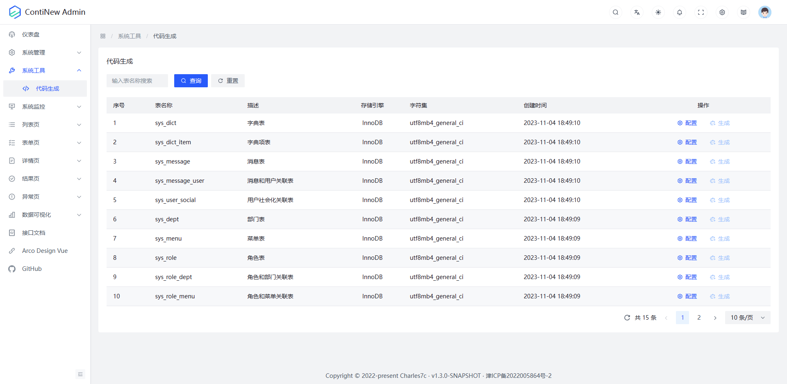</td>
            <td></td>
        </tr>
        <tr>
            <td></td>
            <td>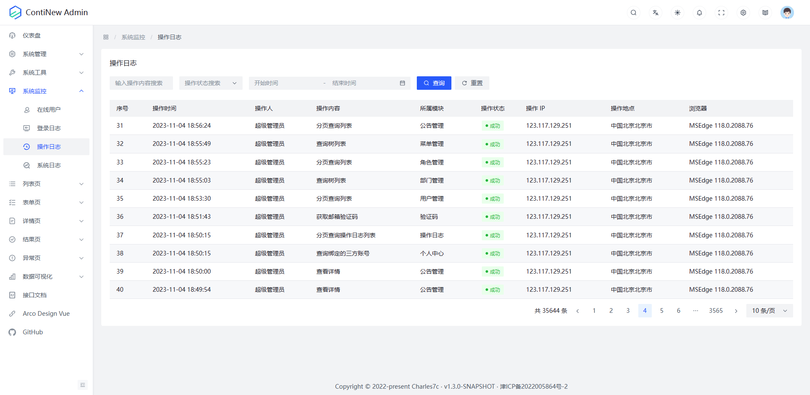</td>
        </tr>
        <tr>
            <td>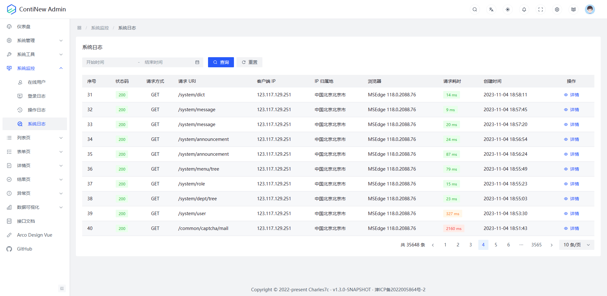</td>
            <td>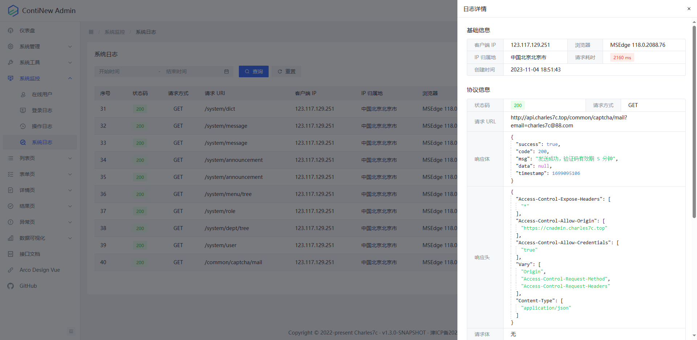</td>
        </tr>
    </tbody>
</table>

## 快速开始

> **Note**
> 更详细的流程，请查看在线文档[《快速开始》](https://doc.charles7c.top/admin/intro/quick-start.html)。

```bash
# 1.克隆本项目
git clone https://github.com/Charles7c/continew-admin.git

# 2.在 IDE（IntelliJ IDEA/Eclipse）中打开本项目

# 3.修改配置文件中的数据源配置信息、Redis 配置信息、邮件配置信息等
# [3.也可以在 IntelliJ IDEA 中直接配置程序启动环境变量（DB_HOST、DB_PORT、DB_USER、DB_PWD、DB_NAME；REDIS_HOST、REDIS_PORT、REDIS_PWD、REDIS_DB）]

# 4.启动程序
# 4.1 启动成功：访问 http://localhost:8000/，页面输出：Xxx started successfully.
# 4.2 接口文档：http://localhost:8000/doc.html

# 5.部署
# 5.1 Docker 部署
#   5.1.1 服务器安装好 docker 及 docker-compose（参考：https://blog.charles7c.top/categories/fragments/2022/10/31/CentOS%E5%AE%89%E8%A3%85Docker）
#   5.1.2 执行 mvn package 进行项目打包，将 target/app 目录下的所有内容放到 /docker/continew-admin 目录下
#   5.1.3 将 docker 目录上传到服务器 / 目录下，并授权（chmod -R 777 /docker）
#   5.1.4 修改 docker-compose.yml 中的 MySQL 配置、Redis 配置、continew-admin-server 配置、Nginx 配置
#   5.1.5 执行 docker-compose up -d 创建并后台运行所有容器
# 5.2 其他方式部署
```

## 核心技术栈

| 名称                                                         | 版本             | 简介                                                         |
| :----------------------------------------------------------- |:---------------| :----------------------------------------------------------- |
| [ContiNew Starter](https://github.com/Charles7c/continew-starter) | 1.1.1-SNAPSHOT | ContiNew Starter（Continue New Starter）是一种特殊类型的 Spring Boot Starter，其作用与常规的 Starter 类似，基于“约定优于配置”的理念，再次精简常规配置，提供一个更为完整的配置解决方案，帮助开发人员更加快速的集成常用第三方库或工具到 Spring Boot Web 应用程序中。 |
| <a href="https://spring.io/projects/spring-boot" target="_blank">Spring Boot</a> | 3.1.7          | 简化 Spring 应用的初始搭建和开发过程，基于“约定优于配置”的理念，使开发人员不再需要定义样板化的配置。（Spring Boot 3.0 开始，要求 Java 17 作为最低版本） |
| <a href="https://undertow.io/" target="_blank">Undertow</a>  | 2.3.10.Final   | 采用 Java 开发的灵活的高性能 Web 服务器，提供包括阻塞和基于 NIO 的非堵塞机制。 |
| <a href="https://sa-token.dev33.cn/" target="_blank">Sa-Token + JWT</a> | 1.37.0         | 轻量级 Java 权限认证框架，让鉴权变得简单、优雅。             |
| <a href="https://baomidou.com/" target="_blank">MyBatis Plus</a> | 3.5.4.1        | MyBatis 的增强工具，在 MyBatis 的基础上只做增强不做改变，简化开发、提高效率。 |
| <a href="https://www.kancloud.cn/tracy5546/dynamic-datasource/2264611" target="_blank">dynamic-datasource-spring-boot-starter</a> | 4.2.0          | 基于 Spring Boot 的快速集成多数据源的启动器。                |
| Hikari                                                       | 5.0.1          | JDBC 连接池，号称 “史上最快连接池”，SpringBoot 在 2.0 之后，采用的默认数据库连接池就是 Hikari。 |
| <a href="https://dev.mysql.com/downloads/mysql/" target="_blank">MySQL</a> | 8.0.33         | 体积小、速度快、总体拥有成本低，是最流行的关系型数据库管理系统之一。 |
| <a href="https://dev.mysql.com/doc/connector-j/8.0/en/" target="_blank">mysql-connector-j</a> | 8.0.33         | MySQL Java 驱动。                                            |
| <a href="https://github.com/p6spy/p6spy" target="_blank">P6Spy</a> | 3.9.1          | SQL 性能分析组件。                                           |
| <a href="https://github.com/liquibase/liquibase" target="_blank">Liquibase</a> | 4.20.0         | 用于管理数据库版本，跟踪、管理和应用数据库变化。             |
| <a href="https://github.com/redisson/redisson/wiki/Redisson%E9%A1%B9%E7%9B%AE%E4%BB%8B%E7%BB%8D" target="_blank">Redisson</a> | 3.25.2         | 不仅仅是一个 Redis Java 客户端，Redisson 充分的利用了 Redis 键值数据库提供的一系列优势，为使用者提供了一系列具有分布式特性的常用工具：分布式锁、限流器等。 |
| <a href="https://redis.io/" target="_blank">Redis</a>        | 7.2.3          | 高性能的 key-value 数据库。                                  |
| [X File Storage](https://x-file-storage.xuyanwu.cn/#/)       | 2.0.0          | 一行代码将文件存储到本地、FTP、SFTP、WebDAV、阿里云 OSS、华为云 OBS...等其它兼容 S3 协议的存储平台。 |
| <a href="https://sms4j.com/" target="_blank">SMS4J</a>       | 3.0.4          | 短信聚合框架，轻松集成多家短信服务，解决接入多个短信 SDK 的繁琐流程。 |
| <a href="https://justauth.cn/" target="_blank">Just Auth</a> | 1.16.6         | 开箱即用的整合第三方登录的开源组件，脱离繁琐的第三方登录 SDK，让登录变得 So easy！ |
| <a href="https://easyexcel.opensource.alibaba.com/" target="_blank">Easy Excel</a> | 3.3.3          | 一个基于 Java 的、快速、简洁、解决大文件内存溢出的 Excel 处理工具。 |
| [AJ-Captcha](https://ajcaptcha.beliefteam.cn/captcha-doc/)   | 1.3.0          | Java 行为验证码，包含滑动拼图、文字点选两种方式，UI支持弹出和嵌入两种方式。 |
| Easy Captcha                                                 | 1.6.2          | Java 图形验证码，支持 gif、中文、算术等类型，可用于 Java Web、JavaSE 等项目。 |
| <a href="https://doc.xiaominfo.com/" target="_blank">Knife4j</a> | 4.4.0          | 前身是 swagger-bootstrap-ui，集 Swagger2 和 OpenAPI3 为一体的增强解决方案。 |
| <a href="https://www.hutool.cn/" target="_blank">Hutool</a>  | 5.8.24         | 小而全的 Java 工具类库，通过静态方法封装，降低相关 API 的学习成本，提高工作效率，使 Java 拥有函数式语言般的优雅，让 Java 语言也可以“甜甜的”。 |
| <a href="https://projectlombok.org/" target="_blank">Lombok</a> | 1.18.30        | 在 Java 开发过程中用注解的方式，简化了 JavaBean 的编写，避免了冗余和样板式代码，让编写的类更加简洁。 |

## 项目结构

采用按功能拆分模块的开发方式，项目目录结构如下：

> **Note**
> 下方项目目录结构是按照模块的层次顺序进行介绍的，实际 IDE 中 `continew-admin-common` 模块会因为字母排序原因排在上方。

```bash
continew-admin  # 全局通用项目配置及依赖版本管理
  ├─ continew-admin-webapi   # API 模块（存放 Controller 层代码，打包部署的模块）
  │  └─ src
  │    └─ main
  │      ├─ java        # 工程源文件代码目录
  │      │  └─ top
  │      │    └─ charles7c
  │      │      └─ continew
  │      │        └─ admin
  │      │          ├─ webapi
  │      │          │  ├─ auth     # 认证相关 API
  │      │          │  ├─ common   # 公共相关 API（例如：验证码 API 等）
  │      │          │  ├─ monitor  # 系统监控相关 API
  │      │          │  ├─ system   # 系统管理相关 API
  │      │          │  └─ tool     # 系统工具相关 API
  │      │          └─ ContinewAdminApplication.java  # 启动入口
  │      └─ resources   # 工程配置目录
  │        ├─ db.changelog   # 数据库脚本文件
  │        │  ├─ v1.0.0        # v1.0.0 版本数据库脚本文件
  │        │  ├─ v1.1.0        # v1.1.0 版本数据库脚本文件
  │        │  ├─ v1.2.0        # v1.2.0 版本数据库脚本文件
  │        │  └─ v1.3.0        # v1.3.0 版本数据库脚本文件
  │        └─ templates      # 模板文件
  │          └─ mail           # 邮件模板
  ├─ continew-admin-monitor  # 系统监控模块（存放系统监控模块相关功能，例如：日志管理、服务监控等）
  │  └─ src
  │    └─ main
  │      ├─ java        # 工程源文件代码目录
  │      │  └─ top
  │      │    └─ charles7c
  │      │      └─ continew
  │      │        └─ admin
  │      │          └─ monitor
  │      │            ├─ annotation    # 系统监控相关注解
  │      │            ├─ config        # 系统监控相关配置
  │      │            │  └─ properties   # 系统监控相关配置属性
  │      │            ├─ enums         # 系统监控相关枚举
  │      │            ├─ filter        # 系统监控相关过滤器
  │      │            ├─ interceptor   # 系统监控相关拦截器
  │      │            ├─ mapper        # 系统监控相关 Mapper
  │      │            ├─ model         # 系统监控相关模型
  │      │            │  ├─ entity       # 系统监控相关实体对象
  │      │            │  ├─ query        # 系统监控相关查询条件
  │      │            │  └─ resp         # 系统监控相关响应对象（Response）
  │      │            └─ service       # 系统监控相关业务接口及实现类
  │      │               └─ impl         # 系统监控相关业务实现类
  │      └─ resources   # 工程配置目录
  │         └─ mapper       # MyBatis Mapper XML 文件目录
  ├─ continew-admin-system   # 系统管理模块（存放系统管理模块相关功能，例如：部门管理、角色管理、用户管理等）
  │  └─ src
  │    └─ main
  │      ├─ java        # 工程源文件代码目录
  │      │  └─ top
  │      │    └─ charles7c
  │      │      └─ continew
  │      │        └─ admin
  │      │          ├─ auth     # 系统认证相关业务及配置
  │      │          │  ├─ config    # 系统认证相关配置
  │      │          │  │  └─ satoken    # Sa-Token 配置
  │      │          │  ├─ model     # 系统认证相关模型
  │      │          │  │  ├─ query      # 系统认证相关查询条件
  │      │          │  │  ├─ req        # 系统认证相关请求对象
  │      │          │  │  └─ resp       # 系统认证相关响应对象
  │      │          │  └─ service   # 系统认证相关业务接口及实现类
  │      │          │     └─ impl       # 系统认证相关业务实现类
  │      │          └─ system   # 系统管理相关业务及配置
  │      │            ├─ enums      # 系统管理相关枚举
  │      │            ├─ mapper     # 系统管理相关 Mapper
  │      │            ├─ model      # 系统管理相关模型
  │      │            │  ├─ entity      # 系统管理相关实体对象
  │      │            │  ├─ query       # 系统管理相关查询条件
  │      │            │  ├─ req         # 系统管理相关请求对象
  │      │            │  └─ resp        # 系统管理相关响应对象
  │      │            └─ service    # 系统管理相关业务接口及实现类
  │      │               └─ impl        # 系统管理相关业务实现类
  │      └─ resources   # 工程配置目录
  │         └─ mapper        # MyBatis Mapper XML 文件目录
  ├─ continew-admin-tool  # 系统工具模块（存放系统工具模块相关功能，例如：代码生成、文件管理等）
  │  └─ src
  │    └─ main
  │      ├─ java        # 工程源文件代码目录
  │      │  └─ top
  │      │    └─ charles7c
  │      │      └─ continew
  │      │        └─ admin
  │      │          └─ tool
  │      │            ├─ config        # 系统工具相关配置
  │      │            │  └─ properties    # 系统工具相关配置属性
  │      │            ├─ enums         # 系统工具相关枚举
  │      │            ├─ mapper        # 系统工具相关 Mapper
  │      │            ├─ model         # 系统工具相关模型
  │      │            │  ├─ entity        # 系统工具相关实体对象
  │      │            │  ├─ query         # 系统工具相关查询条件
  │      │            │  ├─ req           # 系统工具相关请求对象
  │      │            │  └─ resp          # 系统工具相关响应对象
  │      │            └─ service       # 系统工具相关业务接口及实现类
  │      │               └─ impl          # 系统工具相关业务实现类
  │      └─ resources   # 工程配置目录
  │        ├─ mapper        # MyBatis Mapper XML 文件目录
  │        └─ templates     # 模板文件
  │          └─ generator       # 代码生成器模板
  ├─ continew-admin-common   # 公共模块（存放公共工具类，公共配置等）
  │  └─ src
  │    └─ main
  │      └─ java        # 工程源文件代码目录
  │        └─ top
  │          └─ charles7c
  │            └─ continew
  │              └─ admin
  │                └─ common
  │                  ├─ annotation    # 公共注解
  │                  ├─ base          # 公共基类
  │                  ├─ config        # 公共配置
  │                  │  ├─ easyexcel    # Easy Excel 配置
  │                  │  ├─ jackson      # Jackson 配置
  │                  │  ├─ mybatis      # MyBatis Plus 配置
  │                  │  └─ properties   # 公共配置属性
  │                  ├─ constant      # 公共常量
  │                  ├─ enums         # 公共枚举
  │                  ├─ handler       # 公共处理器
  │                  ├─ model         # 公共模型
  │                  │  ├─ dto          # 公共 DTO（Data Transfer Object）
  │                  │  ├─ req          # 公共请求对象
  │                  │  └─ resp         # 公共响应对象
  │                  ├─ service       # 公共业务接口
  │                  └─ util          # 公共工具类
  │                    ├─ helper        # 公共 Helper（助手）
  │                    └─ holder        # 公共 Holder（持有者）
```

## 贡献指南

ContiNew Admin 致力于持续以最新流行技术栈构建，拥抱变化，迭代优化。作为一个开源项目，Creator 的初心是希望 ContiNew Admin 依托开源协作模式，提升技术透明度、放大集体智慧、共创优秀实践，源源不断地为企业级项目开发提供助力。

我们非常欢迎广大社区用户为 ContiNew Admin **贡献（开发，测试、文档等）** 或优化代码，欢迎各位感兴趣的小伙伴儿，[添加微信](https://doc.charles7c.top/support.html) 讨论或认领任务。

### 分支说明

ContiNew Admin 的分支目前分为下个大版本的开发分支和上个大版本的维护分支，PR 前请注意对应分支是否处于维护状态，版本支持情况请查看 [更新日志/版本支持](https://doc.charles7c.top/admin/other/changelog.html#%E7%89%88%E6%9C%AC%E6%94%AF%E6%8C%81)。

| 分支  | 说明                                                         |
| ----- | ------------------------------------------------------------ |
| dev   | 开发分支，默认为下个大版本的 SNAPSHOT 版本，接受新功能或新功能优化 PR |
| x.x.x | 维护分支，在 vx.x.x 版本维护期终止前（一般为下个大版本发布前），用于修复上个版本的 Bug，只接受已有功能修复，不接受新功能 PR |

### 贡献代码

如果您想提交新功能或优化现有代码，可以按照以下步骤操作：

1. 首先，在 Gitee 或 Github 上将项目 fork 到您自己的仓库
2. 然后，将 fork 过来的项目（即您的项目）克隆到本地
3. 切换到当前仍在维护的分支（请务必充分了解分支使用说明，可进群联系维护者确认）
4. 开始修改代码，修改完成后，将代码 commit 并 push 到您的远程仓库
5. 在 Gitee 或 Github 上新建 pull request（pr），选择好源和目标，按模板要求填写说明信息后提交即可（多多参考 [已批准合并的 pr 记录](https://github.com/Charles7c/continew-admin/pulls?q=is%3Apr+is%3Amerged)，会大大增加批准合并率）
6. 最后，耐心等待维护者合并您的请求即可

请记住，如果您有任何疑问或需要帮助，我们将随时提供支持。

> **IMPORTANT**
> 欢迎大家为 ContiNew Admin 贡献代码，我们非常感谢您的支持！为了更好地管理项目，维护者有一些要求：
>
> 1. 请确保代码、配置文件的结构和命名规范良好，完善的代码注释甚至包括接口文档参数示例，并遵循阿里巴巴的 <a href="https://github.com/Charles7c/continew-admin/blob/dev/code-style/Java%E5%BC%80%E5%8F%91%E6%89%8B%E5%86%8C(%E9%BB%84%E5%B1%B1%E7%89%88).pdf" target="_blank">《Java开发手册(黄山版)》</a> 中的代码规范，保证代码质量和可维护性
> 2. 在提交代码前，请按照 [Angular 提交规范](https://github.com/conventional-changelog/conventional-changelog/tree/master/packages/conventional-changelog-angular) 编写 commit 的 message（建议在 IntelliJ IDEA 中下载并安装 Git Commit Template 插件，以便按照规范进行 commit）
> 3. 提交代码之前，请关闭所有代码窗口，执行 mvn compile 命令（项目已配置代码格式化插件，编译通过的同时也会自动进行代码格式化），编译通过后，不要再打开查看任何代码窗口，直接提交即可，以免不同的 IDE 配置会自动进行代码格式化

## 反馈交流

欢迎各位小伙伴儿扫描下方二维码加好友，备注 `cnadmin`，拉你进群，探讨技术、提提需求~   

加入交流群后，你将会：

- 第一时间收到框架动态
- 第一时间收到框架更新通知
- 第一时间收到框架 Bug 通知
- 和众多大佬互相 (huá shuǐ) 交流 (mō yú)

<div align="left">
  
</div>
<details>
<summary>无加群意愿</summary>
如无加群意愿，欢迎在 <a href="https://github.com/Charles7c/continew-admin/issues" target="_blank">Issues</a> 中反馈交流~ 🍻
</details>

## 鸣谢

### 鸣谢

感谢参与贡献的每一位小伙伴🥰

<a href="https://github.com/Charles7c/continew-admin/graphs/contributors">
  
</a>

### 特别鸣谢

- 感谢 <a href="https://www.jetbrains.com/" target="_blank">JetBrains</a> 提供的 <a href="https://www.jetbrains.com/shop/eform/opensource" target="_blank">非商业开源软件开发授权</a> 
- 感谢 <a href="https://github.com/baomidou/mybatis-plus" target="_blank">MyBatis Plus</a>、<a href="https://github.com/dromara/sa-token" target="_blank">Sa-Token</a> 、<a href="https://github.com/alibaba/easyexcel" target="_blank">Easy Excel</a>、<a href="https://github.com/xiaoymin/knife4j" target="_blank">Knife4j</a>、<a href="https://github.com/dromara/hutool" target="_blank">Hutool</a> 等国产开源组件作者为国内开源世界作出的贡献
- 感谢项目使用或未使用到的每一款开源组件，致敬各位开源先驱 :fire:

## License

- 遵循 <a href="https://github.com/Charles7c/continew-admin/blob/dev/LICENSE" target="_blank">Apache-2.0</a> 开源许可协议
- Copyright © 2022-present <a href="https://blog.charles7c.top" target="_blank">Charles7c</a>

## GitHub Star 趋势

